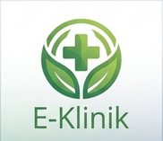

    
    <h1>E-Klinik Management System</h1>
    
<i>Sistem Informasi Manajemen Klinik & Command Center Cerdas</i>

---

## 🎯 Tujuan Utama (Purpose)
**E-Klinik** dibangun dengan tujuan untuk mendigitalisasi dan menyederhanakan seluruh proses operasional di dalam sebuah klinik medis. Sistem ini tidak hanya berfokus pada pencatatan administratif, melainkan berevolusi menjadi sebuah **Command Center** (Ruang Kontrol) bagi pengelola klinik untuk memantau keadaan secara *real-time*.

## 💡 Masalah yang Diselesaikan (Problems Solved)
Sistem ini hadir untuk memecahkan berbagai masalah klasik yang sering terjadi di klinik konvensional:
1. **Penumpukan Antrean**: Memiliki fitur *Live Queue Balancing* untuk mengarahkan pasien ke dokter yang sedang kosong secara dinamis.
2. **Keterlambatan Penanganan Medis**: Memiliki sistem *Early Warning System (EWS)* untuk memberikan peringatan dini terkait okupansi ruangan dan log sistem operasional.
3. **Rekam Medis Berantakan**: Digitalisasi histori pemeriksaan, resep obat, dan keluhan pasien yang terpusat dan terenkripsi.
4. **Data Tercecer**: Menggabungkan seluruh manajemen pilar klinik (Dokter, Pasien, Obat, dan Ruang) ke dalam satu pintu basis data yang aman.
5. **Keamanan Akses**: Sistem otentikasi (Super Admin, Dokter, Pasien) yang terpisah, memastikan privasi dan wewenang pengguna tetap terjaga.

## 🛠️ Teknologi & Framework yang Digunakan
Sistem ini dibangun menggunakan arsitektur MVC (Model-View-Controller) modern dengan jajaran teknologi berikut:

### Backend
- **Bahasa Pemrograman**: PHP (versi 8.x)
- **Framework Utama**: [Laravel](https://laravel.com/) (versi 11.x) - *Dipilih karena keamanan tingkat tinggi, manajemen rute yang sangat baik, dan fitur bawaan seperti Eloquent ORM.*
- **Database**: MySQL - *Untuk penyimpanan data relasional yang kokoh.*

### Frontend
- **Struktur & Interaktivitas**: HTML5, CSS3, JavaScript (Vanilla/ES6)
- **Framework UI/UX**: Bootstrap 4 - *Untuk tampilan responsif (mobile-friendly) dan komponen siap pakai.*
- **Desain & Animasi**: CSS3 3D Transforms - *Digunakan untuk menghasilkan efek interaksi (hover, pulse, pergerakan layout) yang mulus dan elegan.*

---

  <i>Dikembangkan untuk efisiensi pelayanan kesehatan masa depan.</i>

